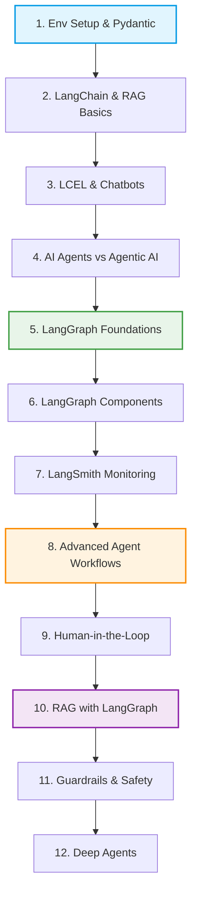

# Agentic AI & LangGraph Study Notes

Welcome to the **Agentic AI & LangGraph Study Notes** repository. This workspace serves as a comprehensive, step-by-step curriculum and hands-on guide for learning, experimenting, and building state-of-the-art **Agentic AI applications** using the **LangChain** and **LangGraph** ecosystems.

Here you will find structured lessons, Jupyter notebooks, visual reference guides (PDFs), and complete working applications that range from basic LLM integration to advanced multi-agent orchestrations.

---

## 🗺️ Learning Roadmap

The sections in this repository are structured sequentially to build your expertise from the ground up:



---

## 📂 Workspace Structure & Sections

| Directory / Section | Description | Key Files / Topics |
| :--- | :--- | :--- |
| 🛠️ [Section02-EnvSetup](file:///Users/vaibhavarde/Desktop/AgentKrish/AgentNotes/Section02-EnvSetup) | Package & virtual environment setup guides. | Conda & UV setup, package management notebooks |
| 📦 [Section04](file:///Users/vaibhavarde/Desktop/AgentKrish/AgentNotes/Section04) | Data validation foundations using Pydantic. | `pydantic-Intro.ipynb` |
| 🔍 [Section05-RAG](file:///Users/vaibhavarde/Desktop/AgentKrish/AgentNotes/Section05-RAG) | Retrieval-Augmented Generation foundations with LangChain. | Ingestion, Transformers, Embeddings, Vector Stores |
| 🤖 [Section06-openai-ollama](file:///Users/vaibhavarde/Desktop/AgentKrish/AgentNotes/Section06-openai-ollama) | Getting started with closed-source (OpenAI) and local (Ollama) LLMs. | Setup, basic prompt invocations, streaming |
| 🔗 [Section07-LLMAppUsingLCEL](file:///Users/vaibhavarde/Desktop/AgentKrish/AgentNotes/Section07-LLMAppUsingLCEL) | Full-stack translation app leveraging LCEL. | FastAPI backend (`serve.py`) & Streamlit UI (`client.py`) |
| 💬 [Section08-ConversationHistory-Chatbots](file:///Users/vaibhavarde/Desktop/AgentKrish/AgentNotes/Section08-ConversationHistory-Chatbots) | Chat applications maintaining context. | Chat history, conversational buffers, persistent memory |
| 🧠 [Section09-AiAgentsVSAgenticAI](file:///Users/vaibhavarde/Desktop/AgentKrish/AgentNotes/Section09-AiAgentsVSAgenticAI) | Theoretical resources distinguishing normal agents from Agentic AI. | Slides, architectural comparisons |
| 📉 [Section10-Langgraph](file:///Users/vaibhavarde/Desktop/AgentKrish/AgentNotes/Section10-Langgraph) | Introduction to LangGraph (Stateful, multi-actor applications). | `1-simplegraph.ipynb`, `2-chatbot.ipynb` |
| 🧩 [Section11-LanggraphComponents](file:///Users/vaibhavarde/Desktop/AgentKrish/AgentNotes/Section11-LanggraphComponents) | Deep dive into states, schemas, and runtime configurations. | Dataclasses, Pydantic state, ReAct agents, streaming |
| 🖥️ [Section12-LangsmithMonitoring](file:///Users/vaibhavarde/Desktop/AgentKrish/AgentNotes/Section12-LangsmithMonitoring) | Production monitoring, tracing, and debugging. | LangSmith configuration, Agent tracing scripts |
| 🔀 [Section13-Workflows](file:///Users/vaibhavarde/Desktop/AgentKrish/AgentNotes/Section13-Workflows) | Implementation of cognitive design patterns. | Chaining, Routing, Parallelization, Orchestrator-Worker, Evaluator-Optimizer |
| 🙋 [Section14-HumanInLoop](file:///Users/vaibhavarde/Desktop/AgentKrish/AgentNotes/Section14-HumanInLoop) | Integrating human feedback, edits, and overrides into graph runs. | Breakpoints, user approval interfaces |
| 📚 [Section15-RAGWithLanggraph](file:///Users/vaibhavarde/Desktop/AgentKrish/AgentNotes/Section15-RAGWithLanggraph) | Advanced self-corrective and adaptive RAG. | Agentic RAG, Corrective RAG (CRAG), Adaptive RAG |
| 🛡️ [Section18-GuardRails](file:///Users/vaibhavarde/Desktop/AgentKrish/AgentNotes/Section18-GuardRails) | Restricting and securing LLM output and behavior. | Guardrails implementation crash course |
| 🚀 [Section19-Deepagents](file:///Users/vaibhavarde/Desktop/AgentKrish/AgentNotes/Section19-Deepagents) | Advanced/deep agent logic testing. | `testDeepAgent.ipynb` |

---

## 🚀 Setup & Installation Instructions

This project uses Python 3.11. You can set up the workspace using either standard pip/conda or the ultra-fast Python package installer **UV**.

### Option A: Setup using `uv` (Recommended)

[uv](https://github.com/astral-sh/uv) is extremely fast and manages python versions, virtualenvs, and dependencies efficiently.

1. **Install uv** (if you haven't already):
   ```bash
   curl -LsSf https://astral.sh/uv/install.sh | sh
   ```
2. **Create & activate the virtual environment**:
   ```bash
   uv venv --python 3.11
   source .venv/bin/activate
   ```
3. **Install dependencies**:
   ```bash
   uv pip install -r requirements.txt
   ```

### Option B: Setup using `conda` / standard virtualenv

1. **Create and activate environment**:
   ```bash
   python3 -m venv .venv
   source .venv/bin/activate
   # On Windows: .venv\Scripts\activate
   ```
2. **Install dependencies**:
   ```bash
   pip install -r requirements.txt
   ```

---

## 🔑 Environment Variables Setup

Create a `.env` file in the root directory (or copy and fill in details) with your API credentials. Here is a list of the variables utilized across the notebooks:

```env
# LLM Providers API Keys
OPENAI_API_KEY="your-openai-api-key"
GROQ_API_KEY="your-groq-api-key"
GOOGLE_API_KEY="your-google-api-key"
HF_TOKEN="your-huggingface-token"

# Search and Tools API Keys
TAVILY_API_KEY="your-tavily-api-key"

# LangSmith Monitoring (Optional but highly recommended)
LANGSMITH_TRACING="true"
LANGSMITH_ENDPOINT="https://api.smith.langchain.com"
LANGSMITH_API_KEY="your-langsmith-api-key"
LANGSMITH_PROJECT="your-project-name"
```

---

## 📖 How to Utilize This Repository

1. **Jupyter Notebooks**: Most of the concepts are detailed inside interactive Jupyter notebooks. Start your Jupyter server or open files inside VS Code:
   ```bash
   jupyter lab
   ```
   Begin with [Section02-EnvSetup](file:///Users/vaibhavarde/Desktop/AgentKrish/AgentNotes/Section02-EnvSetup) and progress sequentially.

2. **Running the FastAPI + Streamlit Translation App**:
   Navigate to [Section07-LLMAppUsingLCEL](file:///Users/vaibhavarde/Desktop/AgentKrish/AgentNotes/Section07-LLMAppUsingLCEL):
   * Start the backend translation server:
     ```bash
     uvicorn LCEL.serve:app --reload
     ```
   * Open a new terminal, activate virtualenv, and start the Streamlit client:
     ```bash
     streamlit run LCEL/client.py
     ```

3. **Running the LangGraph Agent Tracing Demo**:
   Navigate to [Section12-LangsmithMonitoring](file:///Users/vaibhavarde/Desktop/AgentKrish/AgentNotes/Section12-LangsmithMonitoring):
   * Configure your LangSmith environment variables.
   * Run the python agent tracking script:
     ```bash
     python openai_agent.py
     ```